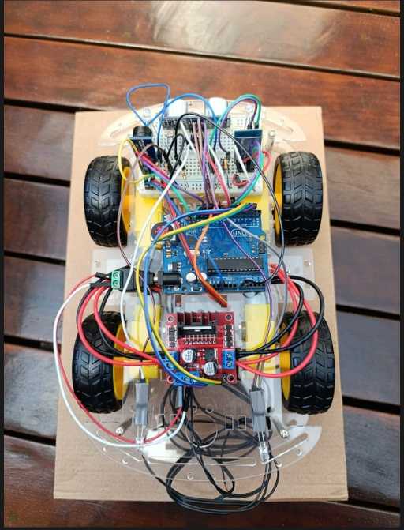
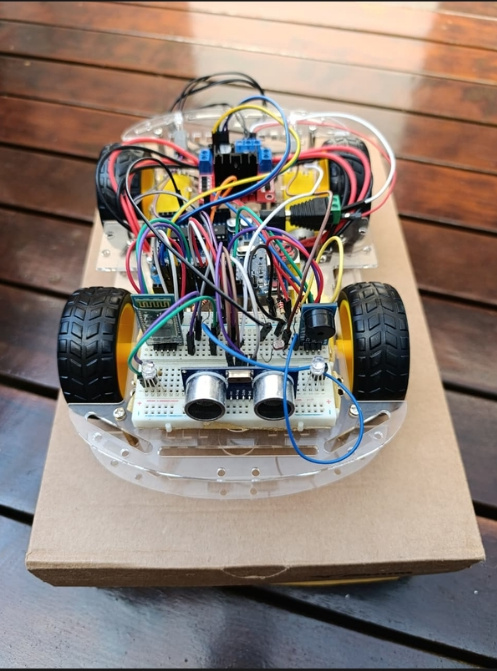

# 🚗 Carrinho Bluetooth com Arduino

Projeto desenvolvido durante o curso **Técnico em Desenvolvimento de Sistemas**, com foco em integração entre hardware e software.

## 📌 Descrição
Sistema de controle de um carrinho via Bluetooth, permitindo o envio de comandos e a comunicação entre **Arduino, Python e PHP**, com integração para exibição e envio de dados a um banco de dados.

As informações do carrinho são exibidas em um site web desenvolvido para acompanhar os dados recebidos em tempo real.

🔗 **Site do projeto:**  
https://carrinho.paparella.com.br/

## 🛠️ Tecnologias utilizadas
- Arduino (C/C++)
- Python
- PHP
- Comunicação Bluetooth
- Integração com banco de dados

## 📦 Lista de materiais
- Arduino Uno  
- Driver L298N (Ponte H)  
- Motores DC  
- HC-SR04 (Sensor Ultrassônico)  
- LDR (Sensor de Luminosidade)  
- LEDs (faróis e traseiros)  
- Buzzer (alerta sonoro)  
- HC-05 (Módulo Bluetooth)  
- Encoder  
- Jumpers macho-macho  
- Jumpers macho-fêmea  

## 🎯 Funcionalidades
- Controle do carrinho via Bluetooth
- Ajuste de comandos para melhor resposta dos movimentos
- Redução de latência nos comandos
- Envio de dados tratados para o banco de dados
- Exibição das informações do carrinho em um site web
- Integração entre hardware e software

## 🎮 Requisitos para funcionamento
- Controle **PS4 ou PS5** (necessário para o controle do carrinho)
- Carrinho com Arduino e módulo Bluetooth configurado
- Computador para execução do código em Python

## 🤖 Uso de Inteligência Artificial
Foi utilizada **Inteligência Artificial como ferramenta de apoio** no desenvolvimento do projeto, principalmente para:

- Auxílio na criação e ajuste do código em **Python**, com foco em:
  - Configuração do controle (PS4/PS5)
  - Redução de latência nos movimentos do carrinho
  - Organização do código para envio limpo de dados ao banco de dados
- Auxílio na utilização e estruturação do código em **PHP**

Todo o código foi **analisado, compreendido, testado e adaptado** por mim e pelo grupo, com foco no aprendizado e na melhoria da solução final.

## 📸 Fotos do carrinho

### Visão superior do carrinho

### Visão traseira do carrinho

## 👥 Créditos
Projeto desenvolvido em grupo por:
- Lucas (Eu)
- Milena
- Pedro
- Kelvyn

Agradecimento especial ao **Professor Pararella**, que disponibilizou seus domínios para possibilitar a publicação do site do projeto.

## 📚 Objetivo do projeto
Aplicar conceitos de lógica de programação, comunicação serial, integração entre linguagens e controle de hardware em um projeto prático, consolidando os conhecimentos adquiridos durante o curso.
